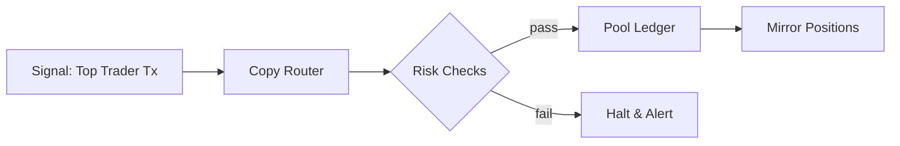

# Copy Trading & Pools

## Structure
Copy pools accept deposits from eligible stakers and mirror trades from a **curated set of top traders** under risk limits.

## Allocation Logic
- Pool follows a basket of signal providers weighted by **Trader Performance Index (TPI)**.  
- Caps per trader and per asset to avoid concentration risk.  
- Real‑time halt if global risk exceeds thresholds.

## Execution Flow

## Fees
- Performance fee with high‑water mark.  
- Management fee can be zero or protocol‑defined.  
- Rebates/boosts for TFT stakers.

## Governance
Community can list/delist signal providers and tune risk parameters.
