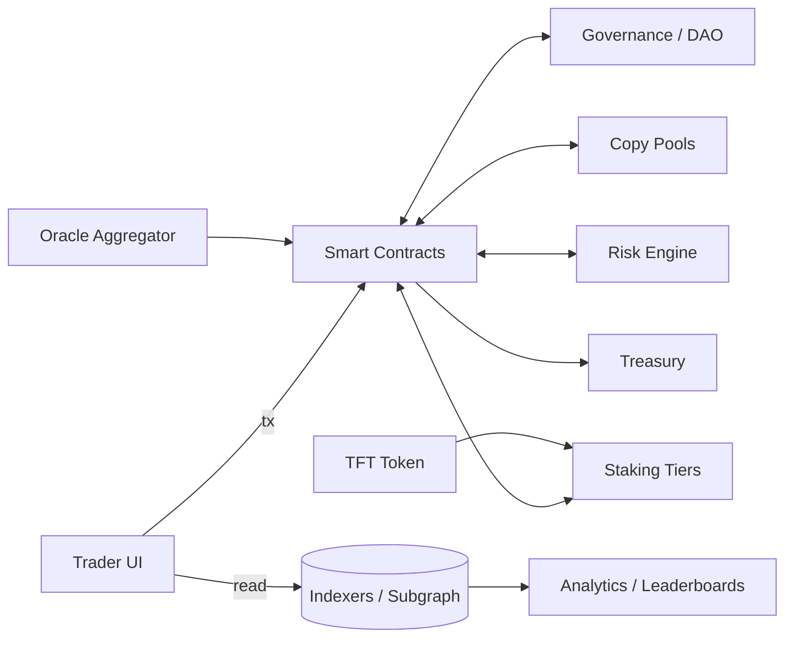
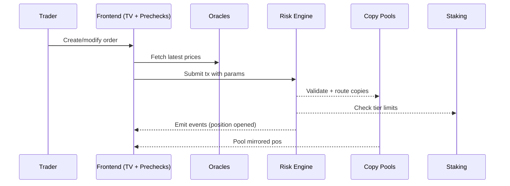

## System Overview
Averix comprises modular smart contracts and an off‑chain execution interface. Core layers:
- **Smart Contracts:** TFT token, staking tiers, risk engine, copy pools, governance.
- **Oracle Layer:** Price feeds (redundant providers with medianization + sanity checks).
- **Trading Interface:** Frontend/UI with TradingView for charting and local risk previews.
- **Indexers & Analytics:** Subgraph/GraphQL endpoints for historical and real‑time metrics.
- **Storage:** On‑chain state + off‑chain logs (IPFS/Arweave for docs and proofs).

## Component Diagram

## Transaction Lifecycle (example)
1. Trader prepares order in UI; local pre‑check computes leverage, exposure, and predicted VF.  
2. Oracle price is fetched; UI displays slippage and risk flags.  
3. Trader submits tx to **Risk Engine** + **Copy Router**.  
4. Contracts validate limits; if valid, position is opened for trader and mirrored into eligible pools.  
5. PnL accrues; periodically rewards are computed and settled on‑chain.  
6. Reputation/NFTs update at checkpoint blocks.

## Data Flow

## Environments
- **Mainnet** (after audits)  
- **Testnet** for public beta and incentive programs  
- **Local forks** for integration testing

## Assumptions & Constraints
- Deterministic risk rules; no privileged backdoors.  
- Chain finality and oracle liveness are safety prerequisites.  
- Fees tuned for cost/benefit neutrality and sustainability.
