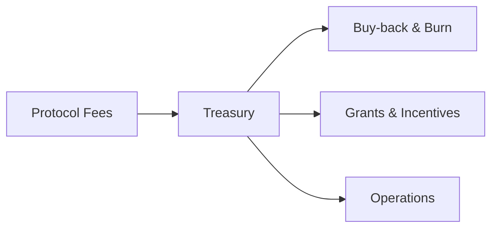

## Value Capture
- Protocol fees -> treasury -> buy‑back & burn / growth.  
- Staking yields sourced from activity, not inflation alone.

## Fee Flow

## Simulations
Run seasonal emission vs. activity models to preserve TFT scarcity while rewarding real usage.
