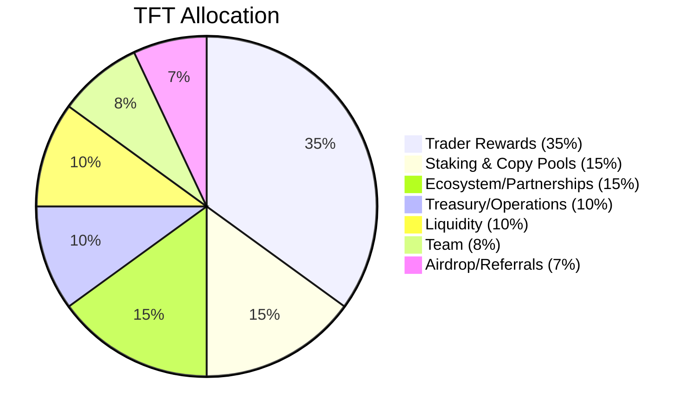

## Distribution

## Treasury
- Supports audits, operations, incentives, and buy‑back programs.  
- Multi‑sig controlled with DAO oversight.

## Sustainability
- Emission decay + buy‑back‑and‑burn.  
- Fee sinks aligned with long‑term TFT value capture.
